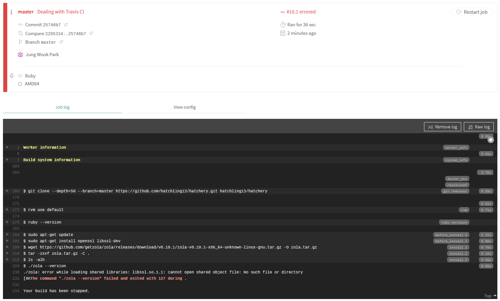
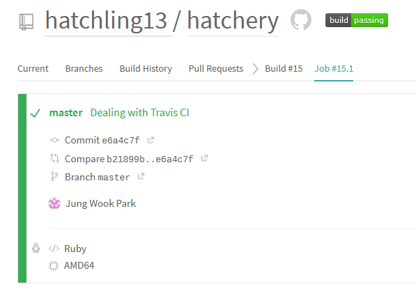

+++
title = "Travis CI로 정적 사이트 생성기 자동 빌드하기"
description = "천하난사 필작어이 천하대사 필작어세"
date = 2020-04-06

[taxonomies]
categories = ["blog"]
tags = ["Continuous Integration", "GitHub Pages", "Zola"]
+++

### 서두
이것도 언젠가는 해야할 일이었는데 그놈의 마크다운 전처리기 다 만들면 한꺼번에 설정하겠다고 염병을 떨다가 집어던져놓고 안하고 있었다. 굳이 모아서 해야하는 게 아니었는데... 티끌 모아 태산이라고 했던가. 분할 정복의 의미를 예전부터 알고 있던 선조님들 대단하기 그지없다. 나도 우선 처리할 수 있는 것들부터 하나씩 완료하면 내가 원하는 인재상이 될 수 있을까. 잡설이 길었다. 본론으로 들어가보자.
<!-- more -->
### 개요
내가 사용하고 있는 [Zola](https://www.getzola.org/)는 물론이고, 웬만한 SSG(Static Site Generator, 정적 사이트 생성기)들은 다음과 같은 작업 흐름을 가진다.
> 1. 글감 작성(Markdown, asciidoc, org-mode 등)
> 2. SSG로 빌드(public 폴더에 html 등의 파일 생성)
> 3. public 폴더의 내용을 실제 호스트할 곳의 저장소로 복사(GitHub Pages, Heroku, Netfliy 등)

그리고 이 모든 것들은 로컬 머신에 SSG가 설치되어있을 때 가능하다. 이는 다시 말해, 원래 작업환경 이외의 공간에서는 블로그 업데이트를 할 수 없다는 의미가 된다. 굉장히 불편하다.

### 해결방안
[Travis CI](https://travis-ci.org/)라는 툴이 있다. 이름대로 CI(Continuous Integration, 지속적 통합)을 위한 툴인데, 많은 기능들 중 빌드 자동화에 집중해보자. [이 문서](https://docs.travis-ci.com/user/tutorial/#to-get-started-with-travis-ci-using-github)에 따르면, GitHub 저장소에 `.travis.yml`파일을 추가해주면 매번 push할 때마다 자동으로 빌드가 이루어진다고 한다. 이 기능을 이용해보도록 하자.
```
.travis.yml

install:
  - wget https://github.com/getzola/zola/releases/download/v0.10.1/zola-v0.10.1-x86_64-unknown-linux-gnu.tar.gz -O zola.tar.gz
  - tar -zxvf zola.tar.gz -C .
  - ./zola --version
script:
  - ./zola build
deploy:
  skip_cleanup: true
  github_token: $GITHUB_TOKEN
  keep_history: true
  on:
    branch: master
  local_dir: public
  repo: hatchling13/hatchling13.github.io
  target_branch: master
  provider: pages
```
저장소를 가져와서 빌드 후 실행하는 것보다는 미리 만들어진 바이너리를 들고오는 게 더 싸게 먹힐 것이다. 절대 직접 빌드해봤는데 깨져서 그런 것이 아니다. 아무튼 나머지 설정은 [이 문서](https://docs.travis-ci.com/user/deployment/pages/)를 보고 설정했다. 빌드되기 전의 디렉토리에 이 설정 파일을 넣고 미리 GitHub에 push해둔다. 이제 GitHub 토큰을 발급받아 Travis CI의 내 계정에 등록시켜주면 빌드가 실행될 것이다. [이 문서](https://docs.travis-ci.com/user/tutorial/#to-get-started-with-travis-ci-using-github)를 참조하니 각 저장소별로 travis가 돌도록 할 수도 있는 모양이다. 토큰은 개인 계정 설정란의 개발자 설정 쪽에 가면 발급 메뉴가 있다. 저장소 관련 체크박스를 체크한 다음 나온 토큰을 Travis 내의 해당 저장소 설정란에 적용시켜주면 된다.

### 해치웠나?

과정을 살펴보니 받는 건 제대로 받았는데 `libssl.so.1.1`이 없어서 못 돌리시겠단다. 무엇을 암시하는 것이지? 혹시 `OpenSSL` 관련 의존성이 안 깔려있는 건가 싶어 `before_install` 단계에서 설치 명령을 줘봤는데 이미 채-신버전으로 들고계시단다. 무엇이 문제일까? 답은 그 놈의 최신 버전이 도대체가 최신이 맞긴 한가의 여부에 있었다. [문서](https://docs.travis-ci.com/user/reference/linux/#overview)에 따르면 Travis CI 빌드머신은 리눅스의 경우 `Ubuntu Xenial 16.04`를 기본 환경으로 지원한다. 그리고 해당 버전에서 `OpenSSL`의 최신 버전은 `1.0.2g`이다. 엿을 먹은 이유가 있었다. [패키지 정보](https://packages.ubuntu.com/search?keywords=openssl)를 찾아보니 `Bionic 18.04`부터 `1.1` 이상의 버전이 최신으로 잡혀있다. [이 문서](https://docs.travis-ci.com/user/reference/bionic/#using-ubuntu-1804-bionic-beaver)에 적힌 대로 배포판 버전을 올려주었다.
```
dist: bionic
```


문제없이 빌드가 끝난 모습이다. 설정 파일에 명시해놓은 저장소에 가보니 잘 커밋된 것을 확인할 수 있었다. 아이고 한 시름 덜었다 야.

### 정리
자동으로 빌드가 되는 건 좋다. 마크다운이야 그냥 일반 텍스트 파일과 별반 다를게 없으니, 이제 어디서건 `git`만 깔려있으면 글을 작성해서 올릴 수 있다. 하지만 그렇다고 해서 문제가 끝난 건 아니다. 근래의 SSG들은 사용자가 쓴 글이 실제로 올라갔을 때 어떻게 보일지 미리 테스트하는 기능을 가지고 있다. Zola의 경우 `zola serve` 명령어를 통해 결과물을 미리보기할 수 있다. 하지만 이렇게 빌드를 자동화시켜버릴 경우 이 기능은 사용할 수 없다. 애초에 로컬 머신이 아닌 이상 어디에서도 마찬가지다. 이는 결국 작성자의 글이 실제로 올라갔을 때 의도대로 보일 것인지를 확인할 수 없다는 뜻이 된다. 이것이 내가 말머리에서 이야기했던 `마크다운 전처리기`를 만들려던 궁극적인 이유다. 언제가 될지는 모르겠지만 전처리기가 완성되면 이 블로그에도 적용될 것이다. 그때쯤이면 좀 마음놓고 쓰고싶은 것들을 쓸 수 있겠지. 혹시나 나같은 힙스터 기질이 있는 사람이 남들 다 쓰는 Jekyll이나 Hugo 같은 거 안 쓰고 Zola를 쓰고 싶다고 하면 내 블로그 저장소의 `.travis.yml`을 따라 써도 크게 문제없을 것이다.

### P.S.
헛짓거리였다 아 ㅋㅋ [이미 있었네](https://www.getzola.org/documentation/deployment/github-pages/). 하지만 SSL 관련해서 엿먹은 건 자산이 된 거 같다. 다만 이건 Travis의 문제라기보다는 내가 쓰는 Zola의 문제라는 점이 좀 달랐달까.